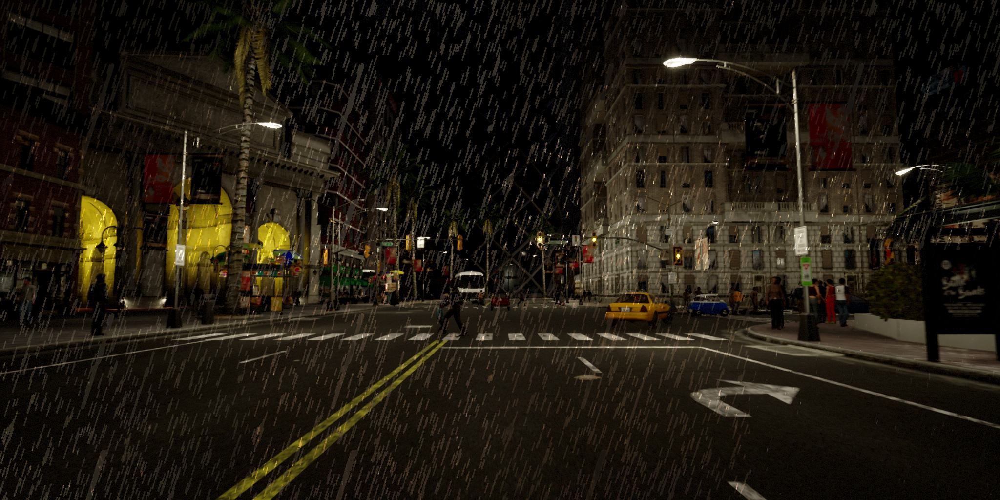
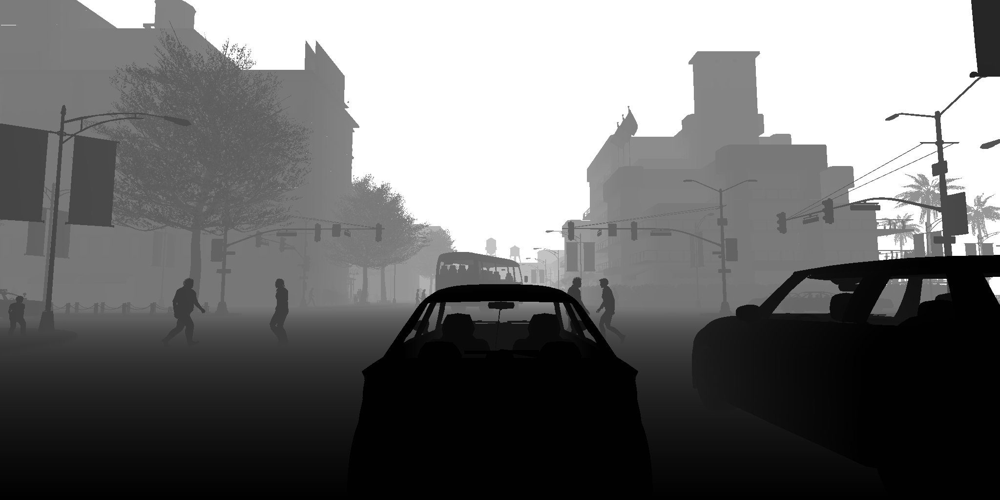

# CARLARain
**A Rainy Autonomous Driving Simulator based on CARLA**

  <a href="./README.md">中文</a> |
  <a href="./README_EN.md">English</a>

CARLARain is an autonomous driving simulator framework that supports the simulation of rainy scenes in complex lighting environments. Based on [CARLA](https://github.com/carla-simulator/carla), it realizes the environmental simulation, vehicle simulation, and pedestrian simulation of driving scenarios. In combination with [HRIGNet](https://kb824999404.github.io/HRIG/) and [CRIGNet](https://doi.org/10.1007/978-981-97-5597-4_8), it introduces controllable and realistic rainy scene simulation in complex lighting environments. This framework can build a rich rainy scene simulation training environment for autonomous driving visual perception algorithms, covering diverse time periods and lighting conditions, and meeting the requirements of multiple tasks such as semantic segmentation, instance segmentation, depth estimation, and object detection in autonomous driving scenarios. 

<table>
<tr>
<td style="border: none; padding: 5px;"></td>
<td style="border: none; padding: 5px;"></td>
</tr>
</table>

## Structure

* `configs`：Configuration files
* `CarRain`：CARLA client code, used to obtain the background RGB images, semantic segmentation maps, instance segmentation maps, depth maps, and object bounding boxes of CARLA simulations
* `CRIGNet`：CRIGNet code, used to generate low-resolution rain streak images
* `RainControlNet`：RainControlNet code, used to expand low-resolution rain streak images into high-resolution rain streak images
* `HRIGNet`：HRIGNet code, used to generate rainy scene images based on background RGB images and rain streak images
* `data`：Output data path

## How to run

### Environment Setup

* CARLA: [Download the CARLA server](https://carla.readthedocs.io/en/latest/start_quickstart/#carla-installation), create a new `carla` conda environment and [configure the CARLA client library](https://carla.readthedocs.io/en/latest/start_quickstart/#install-client-library).
* ControlNet: `cd RainControlNet && conda env create -f environment.yaml`
* HRIGNet: `cd HRIGNet && conda env create -f environment.yaml`

### Prepare Model Weights

* All model weight files can be obtained here: [BaiduCloud](https://pan.baidu.com/s/1FXNk-y86rxXeUYwPoGWnpQ?pwd=i4zi ) (Extraction code: i4zi)
* CRIGNet model weights: Download `CRIGNet/00000-crig_fastgan_g1w0.5_rainTrainL_256-FastGAN` and extract it to `CRIGNet/log_raintrainl_256`
* RainControlNet model weights: Download `RainControlNet/crig_hint256-128_out512_4xgrad_1e-4-2024-10-05-T07-21-55` and extract it to `RainControlNet/logs`
* HRIGNet model weights: Download `HRIGNet/2023-10-19T19-31-52_blender-gdm-rainlayer-hw512-f4-em3` and `2023-10-21T21-50-57_blender-hrig-rainlayer+masked-gdm512-hw512-hybrid-unet128-em3` and extract them to `HRIGNet/logs`

### Prepare YAML Configuration Files

* Refer to `configs/seqTest.yaml`, and for detailed explanations of the content, see [Docs/config.md](./Docs/config.md#EN)

### Run

#### 1. Obtain Background Images and Label Data

* Run the CARLA server:
  * In the CARLA directory, execute `./CarlaUE4.sh -RenderOffScreen -quality-level=Epic`
  * Configure `serverIP` and `serverPort` in `CarRain/config.py`

* Activate the conda environment: `conda activate carla`
* Run the CARLA client to obtain background RGB images, semantic segmentation maps, instance segmentation maps, depth maps, and object bounding boxes: `python CarRain/main.py -c configs/seqTest.yaml`
* Obtain object detection data: `python CarRain/isToDetect.py -c configs/seqTest.yaml`
* Obtain videos: `python CarRain/seqToVideo.py -c configs/seqTest.yaml`

#### 2. Obtain Rain Streak Images

> You can choose to obtain rain streak images as rain layer masks using existing methods, or generate rain streak images using CRIGNet + RainControlNet provided here.

1. **Existing methods**:
   * weather-particle-simulator：https://github.com/astra-vision/weather-particle-simulator
   * Download [RainMask](https://pan.baidu.com/s/1FXNk-y86rxXeUYwPoGWnpQ?pwd=i4zi ), select the rain streak images with the desired resolution and intensity, and place them in`data/rain`

2. **CRIGNet + RainControlNet**:
   * Use CRIGNet to obtain low-resolution rain streak images:
     * `conda activate hrig`
     * `cd CRIGNet&&python gen_rain_mask.py -c../configs/seqTest.yaml&&cd..`

   * Use RainControlNet to obtain high-resolution rain streak images:
     * `conda activate control`
     * `cd RainControlNet&&python upscale_rain_mask.py -c../configs/seqTest.yaml&&cd..`

#### 3. Obtain Rainy Images

* Use HRIGNet to obtain rainy images:
  * `conda activate hrig`
  * `cd HRIGNet&&python predict_car.py -c../configs/seqTownsCombineTest.yaml`

## CARLARain Dataset

Based on CARLARain, we constructed an autonomous driving rainy - scene image dataset. We utilized eight different built-in scenarios provided by CARLA and set the time to three periods: daytime, evening, and night, to simulate driving scenarios under different lighting conditions. In terms of vehicle and pedestrian simulation, 100 vehicles and 500 pedestrians were randomly placed in each scene. The resolution of the rendered images is 2048×1024.

This dataset includes eight different scenarios. Each scenario contains three time periods, and each time period consists of 1000 frames of samples. Each sample includes RGB images of clear autonomous driving scenes, semantic segmentation images, instance segmentation images, depth images, rain-streak images, rainy RGB images, and object bounding-box data. The dataset is divided into a training set and a test set according to the scenarios. The training set includes seven scenarios, and the test set includes one scenario.

The dataset can be downloaded from [CARLARain-Dataset](https://pan.baidu.com/s/1FXNk-y86rxXeUYwPoGWnpQ?pwd=i4zi) (Extraction code: i4zi)

<table>
<tr>
<th>Dataset Type </th>
<th>Scene </th>
<th>Time </th>
<th>Frame </th>
<th>Sample Count </th>
<th>Image Type </th>
</tr>
<tr>
<td>Trainset</td>
<td>7</td>
<td>3</td>
<td>1000</td>
<td>21000</td>
<td rowspan=2> Scene RGB image, semantic segmentation image, instance segmentation image, depth image, rain streak image, rainy RGB image, object bounding box</td>
</tr>
<tr>
<td>Testset</td>
<td>1</td>
<td>3</td>
<td>1000</td>
<td>3000</td>
</tr>
</table>

<table>
<tr>
<th>Background </th>
<th>Rainy </th>
<th>Depth </th>
<th>Semantic Segmentation </th>
<th>Instance Segmentation </th>
</tr>
<tr>
<td style="padding: 0;width=20%;"></td>
<td style="padding: 0;width=20%;"></td>
<td style="padding: 0;width=20%;"></td>
<td style="padding: 0;width=20%;"></td>
<td style="padding: 0;width=20%;"></td>
</tr>
<tr>
<td style="padding: 0;width=20%;"></td>
<td style="padding: 0;width=20%;"></td>
<td style="padding: 0;width=20%;"></td>
<td style="padding: 0;width=20%;"></td>
<td style="padding: 0;width=20%;"></td>
</tr>
<tr>
<td style="padding: 0;width=20%;"></td>
<td style="padding: 0;width=20%;"></td>
<td style="padding: 0;width=20%;"></td>
<td style="padding: 0;width=20%;"></td>
<td style="padding: 0;width=20%;"></td>
</tr>

<tr>
<td style="padding: 0;width=20%;"></td>
<td style="padding: 0;width=20%;"></td>
<td style="padding: 0;width=20%;"></td>
<td style="padding: 0;width=20%;"></td>
<td style="padding: 0;width=20%;"></td>
</tr>
<tr>
<td style="padding: 0;width=20%;"></td>
<td style="padding: 0;width=20%;"></td>
<td style="padding: 0;width=20%;"></td>
<td style="padding: 0;width=20%;"></td>
<td style="padding: 0;width=20%;"></td>
</tr>
<tr>
<td style="padding: 0;width=20%;"></td>
<td style="padding: 0;width=20%;"></td>
<td style="padding: 0;width=20%;"></td>
<td style="padding: 0;width=20%;"></td>
<td style="padding: 0;width=20%;"></td>
</tr>
<tr>
<td style="padding: 0;width=20%;"></td>
<td style="padding: 0;width=20%;"></td>
<td style="padding: 0;width=20%;"></td>
<td style="padding: 0;width=20%;"></td>
<td style="padding: 0;width=20%;"></td>
</tr>
<tr>
<td style="padding: 0;width=20%;"></td>
<td style="padding: 0;width=20%;"></td>
<td style="padding: 0;width=20%;"></td>
<td style="padding: 0;width=20%;"></td>
<td style="padding: 0;width=20%;"></td>
</tr>
<tr>
<td style="padding: 0;width=20%;"></td>
<td style="padding: 0;width=20%;"></td>
<td style="padding: 0;width=20%;"></td>
<td style="padding: 0;width=20%;"></td>
<td style="padding: 0;width=20%;"></td>
</tr>
<tr>
<td style="padding: 0;width=20%;"></td>
<td style="padding: 0;width=20%;"></td>
<td style="padding: 0;width=20%;"></td>
<td style="padding: 0;width=20%;"></td>
<td style="padding: 0;width=20%;"></td>
</tr>
<tr>
<td style="padding: 0;width=20%;"></td>
<td style="padding: 0;width=20%;"></td>
<td style="padding: 0;width=20%;"></td>
<td style="padding: 0;width=20%;"></td>
<td style="padding: 0;width=20%;"></td>
</tr>
<tr>
<td style="padding: 0;width=20%;"></td>
<td style="padding: 0;width=20%;"></td>
<td style="padding: 0;width=20%;"></td>
<td style="padding: 0;width=20%;"></td>
<td style="padding: 0;width=20%;"></td>
</tr>
<tr>
<td style="padding: 0;width=20%;"></td>
<td style="padding: 0;width=20%;"></td>
<td style="padding: 0;width=20%;"></td>
<td style="padding: 0;width=20%;"></td>
<td style="padding: 0;width=20%;"></td>
</tr>
<tr>
<td style="padding: 0;width=20%;"></td>
<td style="padding: 0;width=20%;"></td>
<td style="padding: 0;width=20%;"></td>
<td style="padding: 0;width=20%;"></td>
<td style="padding: 0;width=20%;"></td>
</tr>
<tr>
<td style="padding: 0;width=20%;"></td>
<td style="padding: 0;width=20%;"></td>
<td style="padding: 0;width=20%;"></td>
<td style="padding: 0;width=20%;"></td>
<td style="padding: 0;width=20%;"></td>
</tr>
<tr>
<td style="padding: 0;width=20%;"></td>
<td style="padding: 0;width=20%;"></td>
<td style="padding: 0;width=20%;"></td>
<td style="padding: 0;width=20%;"></td>
<td style="padding: 0;width=20%;"></td>
</tr>
<tr>
<td style="padding: 0;width=20%;"></td>
<td style="padding: 0;width=20%;"></td>
<td style="padding: 0;width=20%;"></td>
<td style="padding: 0;width=20%;"></td>
<td style="padding: 0;width=20%;"></td>
</tr>
<tr>
<td style="padding: 0;width=20%;"></td>
<td style="padding: 0;width=20%;"></td>
<td style="padding: 0;width=20%;"></td>
<td style="padding: 0;width=20%;"></td>
<td style="padding: 0;width=20%;"></td>
</tr>
<tr>
<td style="padding: 0;width=20%;"></td>
<td style="padding: 0;width=20%;"></td>
<td style="padding: 0;width=20%;"></td>
<td style="padding: 0;width=20%;"></td>
<td style="padding: 0;width=20%;"></td>
</tr>
<tr>
<td style="padding: 0;width=20%;"></td>
<td style="padding: 0;width=20%;"></td>
<td style="padding: 0;width=20%;"></td>
<td style="padding: 0;width=20%;"></td>
<td style="padding: 0;width=20%;"></td>
</tr>
<tr>
<td style="padding: 0;width=20%;"></td>
<td style="padding: 0;width=20%;"></td>
<td style="padding: 0;width=20%;"></td>
<td style="padding: 0;width=20%;"></td>
<td style="padding: 0;width=20%;"></td>
</tr>

</table>

### License

The CARLARain code is distributed under the MIT License.

## Reference

* CARLA：https://github.com/carla-simulator/carla
* HRIGNet：https://kb824999404.github.io/HRIG/
* CRIGNet：https://doi.org/10.1007/978-981-97-5597-4_8
* ControlNet：https://github.com/lllyasviel/ControlNet
* Rain Rendering：https://github.com/cv-rits/rain-rendering/
